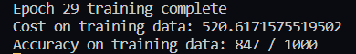
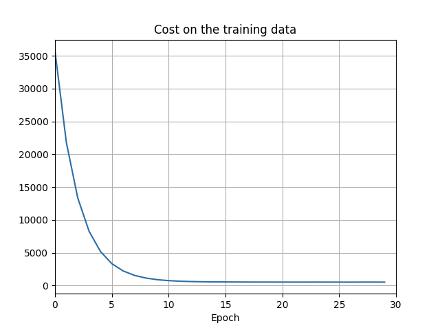
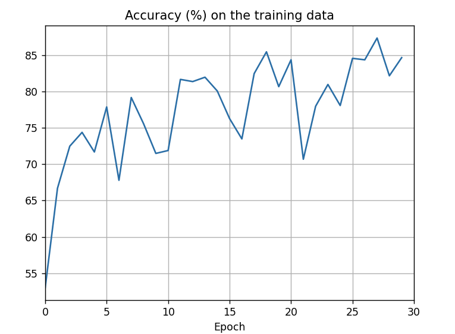

# Introduction

Over this past year i've committed myself to the dense reading of "Neural Networks and Deep Learning" by Michael Nielsen. This project encmopasses the many hours i've spent diving deep into the math and low-level logic of neural networks.

Initially, this deep nueral network was set to an arbitrary 30 epochs. The results of 30 cycles on the training data are displayed in Figure 1.

Figure 1

<!-- ctrl + shift + v for markdown preview -->

For a visuallization  of this, we can see the cost on the training data in Figure 2. It slopes down dramitcally between epochs 0 throgh 10. After that, the amount of cost reduction versus time and computational power severly decreases. Interestingly, it seems the graph takes on a y=1/x shape.
 Figure 2

As we can see here, specifically it looks like after epoch 5, we see the accuracy rate of change severly drop off. This phase of training wastes a lost of computing power and time and is often associated with overfitting.
 Figure 1

It does appear that the network continue to trend up, so here one would have to make a choice of valueing computer time/power vs how accurate their network becomes. If computing time is a concern one might feel ok with keeping their nueral network at 80% accuracy and stopping at epoch 5-8. If computing time is not a concern, then keeping the network at 30 epochs to obtain the last 5% would the be best route. 