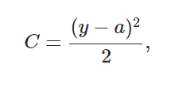
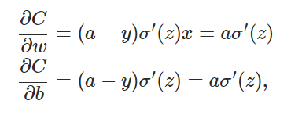
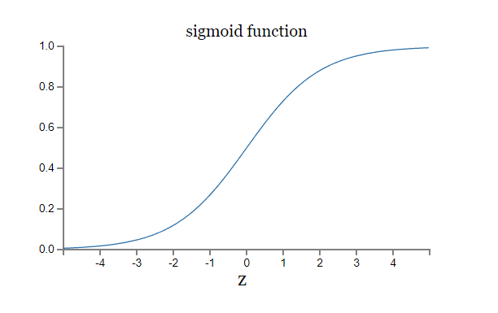
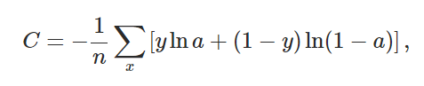
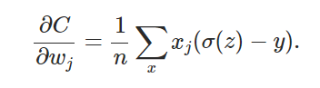
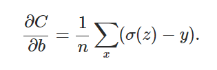
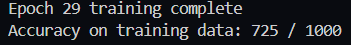
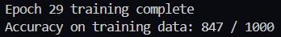
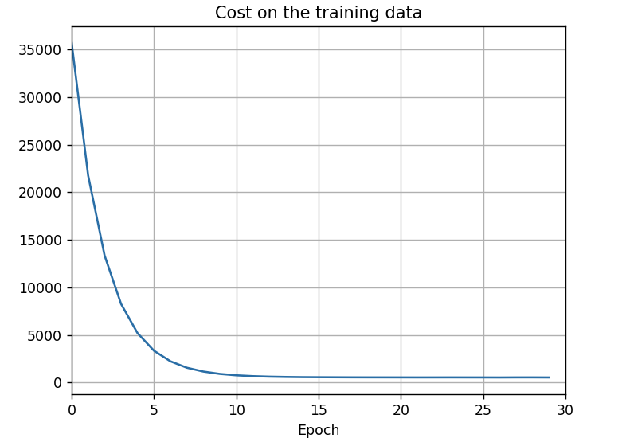

# Introduction

Over this past summer, I committed myself to the dense reading of "Neural Networks and Deep Learning" by Michael Nielsen. This project displays the many hours I've spent diving deep into the math and low-level logic of neural networks. The data set I used for this project was provided by Tesnorflow.com, and is called the fashion mnist data set. It is very similar to the classic mnist data set of handwritten digits that Michal Neilsen originally designed this deep neural network for. This work will act as an overview of some of the many subjects Nielsen touched within his book. 

# Cross-Entropy vs Quadratic Cost
Within Nielsen's deep neural network, one is able to choose between two different cost functions: quadratic cost and cross-entropy. Within the text, great detail is given on the benefits and costs of each, to which i'll touch on the important parts below. Choosing an appropriate cost function for one's neural network is very important as it has a tremendous impact on the accuracy and efficiency of the training.

## Quadratic Cost (MSE)
This is the quadratic cost function where *y* is the actual and *a* is the predicted.

For our gradient descent algorithm, we must use the derivative of the quadratic cost function with respect to the weights and biases like so:

Since this derivative relies on the sigmoid function, let's analyze it.

Quadratic cost is great for training nodes that have a weighted input (z) that's close to 0. In this case, during gradient descent, the derivative of the sigmoid function is very high, resulting in large positive changes to the overall network's cost. However, trouble arises when the weighted input is either very incorrect or correct. In this case, the derivative of the sigmoid function (quadratic cost) is very small, and we'll only see very small changes during gradient descent. For example, in the sigmoid graph above, we can see that when z is near -4 or 4, the slope plateaus, resulting in a smaller derivative. Conversely, when z is around zero the derivative is large and the slope is steep so we see a larger cost. This slow learning can severely negatively affect the rate at which our neural network learns.

## Cross-Entropy Cost
Our second choice of a cost function is the cross-entropy function.

In this equation, *n* is the total number of items in the training data (*n* clothing image), *x* is each training image, *y* is the actual, and *a* is the predicted. A benefit to the cross-entropy is that it avoids the issue of learning slowdown that quadratic cost has.

In both of these partial derivatives, we are no longer dependent on the derivative of the sigmoid function like in the quadratic cost function. Instead in these, like one would expect, the cost is dependent on how large the error is (predicted - actual). This means the larger the error, the larger the cost derivative, resulting in a larger movement during gradient descent.

## Conclusion
Over an arbitrarly chosen 30 epochs, here are the results for each cost function:
### Quadratic Cost

### Cross-Entropy

As we can see here, over the same number of epochs, the cross-entropy was 12% more accurate. This is a very significant jump and is the reason we will be solely working with the cross-entropy function for the rest of this project.

# Training Epochs
Initially, this deep neural network was set to an arbitrary 30 epochs. 

<!-- ctrl + shift + v for markdown preview 
talk about sigmoid vs cross entropy cost
talk about lambda affects and targeting small weights
-->

For a visualization of this, we can see the cost on the training data below. It slopes down dramatically between epochs 0 through 10. After that, the amount of cost reduction versus time and computational power severely decreases. Interestingly, it seems the graph takes on a y=1/x shape.

As we can see in the next image, specifically it looks like after epoch 5, we see the accuracy rate of change severely drop off. This phase of training wastes a lot of computing power and is the result of the network overfitting. A neural network overfitting to it's training data is not productive for applying the network to any sort of validation data or real-world scenerios and is best to avoid.

However, it does appear that the network continues to trend up, so here one would have to make a choice of evaluating computer time/power vs how accurate their network becomes. If computing time is a concern, one might feel okay with keeping their neural network at 80% accuracy and stopping at epoch 5-8. If computing time is not a concern, then keeping the network at 30 epochs to obtain the last 5% would be the best route.

# Conclusion
As seen in the multiple images above, my deep neural network accomplished an 85% accuracy rate after 30 epochs. Although not perfect, this network has shown a strong ability to identifiy different peices of clothing. Such a network could be easily applied to a any clothing website (or more likely, a used clothing app such as Depop and ebay) and could offer a fast and reliable way to collect data.